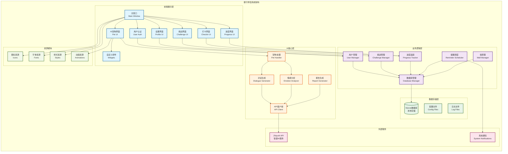

# 善行伴侣 (Kindness Companion) 项目最终文档

## 1. 项目说明

### 1.1 项目名称
**善行伴侣 (Kindness Companion)**

### 1.2 项目简介
善行伴侣是一个旨在通过技术传递善意、鼓励用户实践并反思日常善行的桌面应用程序。本项目参与"代码有温度——用软件守护每一份善意"竞赛，采用API优先策略实现AI功能，确保最佳的可移植性和打包便利性。

项目核心理念包括：
- **鼓励实践**：提供易于参与的善行挑战，将善意融入日常
- **促进反思**：引导用户记录和思考善行带来的感受与影响
- **提供陪伴**：通过AI伙伴给予情感支持和积极反馈
- **可视化进步**：让用户看到自己善行积累带来的积极变化
- **尊重隐私**：将用户数据安全和隐私保护放在首位

### 1.3 项目成员及分工
**开发者**：南京大学 [nju-zym](https://github.com/nju-zym)
- **全栈开发**：负责前端界面设计、后端逻辑实现、AI功能集成
- **架构设计**：系统架构设计、模块化开发、API集成
- **测试与部署**：单元测试、集成测试、应用打包

### 1.4 项目参考资料
#### 心理学理论基础
- **认知行为疗法 (CBT)**：Aaron Beck认知疗法十大认知扭曲模式
- **积极心理学理论**：Martin Seligman PERMA幸福模型
- **Russell维度情感理论**：三维情感空间（愉悦度、唤醒度、控制度）
- **Plutchik情感轮模型**：八种基础情感及其强度层级
- **Rogers人本主义疗法**：无条件积极关怀理论

#### 技术参考
- PySide6官方文档
- ZhipuAI API文档
- PyInstaller打包指南
- SQLite数据库设计规范

### 1.5 项目技术栈
- **语言**：Python 3.10+
- **GUI框架**：PySide6 (LGPLv3许可)
- **数据库**：SQLite3
- **AI服务**：ZhipuAI API
- **任务调度**：APScheduler
- **HTTP请求**：requests
- **测试框架**：pytest, pytest-qt
- **打包工具**：PyInstaller
- **通知系统**：plyer

## 2. 快速开始

### 2.1 安装方式

#### 环境要求
- Python 3.10+
- macOS/Windows/Linux

#### 安装步骤
```bash
# 1. 克隆仓库
git clone https://github.com/nju-zym/kindness-companion.git
cd kindness-companion

# 2. 创建并激活虚拟环境
conda create -n kindness_companion python=3.10
conda activate kindness_companion

# 3. 安装依赖
pip install -r requirements.txt

# 4. 配置API密钥
# 创建config.py文件，配置ZhipuAI API密钥
cp config_template.py config.py
# 编辑config.py，填入您的API密钥

# 5. 运行应用
python kindness_companion_app/main.py
```

### 2.2 使用示例

#### 主界面展示
应用启动后展示温暖简洁的主界面，包含：
- 左侧导航栏：挑战浏览、打卡记录、进度报告、个人设置
- 中央内容区：动态显示选中功能页面
- 右侧AI宠物区：智能伙伴交互界面

#### 基本使用流程
1. **注册/登录**：首次使用需创建账户或使用已有账户登录
2. **浏览挑战**：在挑战页面浏览预设的善行挑战，选择感兴趣的项目订阅
3. **每日打卡**：完成善行后在打卡页面记录，添加个人反思
4. **AI交互**：与AI宠物分享心情，获得鼓励和建议
5. **查看报告**：定期查看进度报告，了解自己的成长轨迹

## 3. 功能列表

### 3.1 核心功能特色

#### 🤖 理论驱动的AI核心
- **基于CBT认知疗法的智能对话分析**：自动识别十大认知扭曲模式，使用苏格拉底式询问引导用户自主发现认知偏误
- **基于PERMA模型的幸福感评估**：全面评估积极情感、投入感、人际关系、人生意义、成就感五个维度
- **基于Russell+Plutchik理论的情感分析**：三维情感空间精确量化，八种基础情感识别

#### 💝 智能虚拟伴侣
- **多层次情感共鸣系统**：情感镜像技术，根据用户情感状态调整回应风格
- **认知层次适配对话**：阶段性干预策略，个性化干预匹配
- **实时自适应学习**：为每个用户维护个性化AI模型

#### 📊 数据驱动洞察
- **多源数据融合分析**：综合对话历史、情感轨迹、认知模式、行为数据
- **可视化心理健康仪表板**：PERMA雷达图、情感时序图、认知模式演变

### 3.2 基础功能模块

#### 🎯 善行挑战管理
- 浏览预设的善行挑战项目
- 个性化挑战订阅和管理
- 挑战进度追踪和统计

#### ✍️ 打卡与反思记录
- 每日善行打卡功能
- 个人反思记录和管理
- 情感状态记录和分析

#### 🏆 进度可视化
- 多维度统计数据展示
- 成就徽章系统
- 个性化进度报告生成

#### ⏰ 智能提醒系统
- 个性化提醒时间设置
- 基于用户行为模式的智能提醒
- 本地通知推送

#### 🔒 隐私安全保护
- 本地数据优先存储
- 明确的AI功能同意机制
- 数据最小化和匿名化处理

### 3.3 未来增强功能
- **AI个性化推荐**：基于用户历史行为智能推荐挑战
- **匿名善意墙**：用户分享善行体验的社区平台
- **AI优化激励机制**：动态调整游戏化元素提高参与度

## 4. 开发说明

### 4.1 文件结构

```
kindness-companion/
├── kindness_companion_app/          # 主应用目录
│   ├── main.py                      # 应用启动入口
│   ├── frontend/                    # 前端UI模块
│   │   ├── main_window.py          # 主窗口
│   │   ├── user_auth.py            # 用户认证界面
│   │   ├── challenge_ui.py         # 挑战浏览界面
│   │   ├── checkin_ui.py           # 打卡记录界面
│   │   ├── progress_ui.py          # 进度报告界面
│   │   ├── profile_ui.py           # 个人设置界面
│   │   ├── pet_ui.py               # AI宠物交互界面
│   │   └── widgets/                # 自定义控件
│   ├── backend/                     # 后端逻辑模块
│   │   ├── database_manager.py     # 数据库管理
│   │   ├── user_manager.py         # 用户管理
│   │   ├── challenge_manager.py    # 挑战管理
│   │   ├── progress_tracker.py     # 进度追踪
│   │   ├── reminder_scheduler.py   # 提醒调度
│   │   └── utils.py                # 工具函数
│   ├── ai_core/                     # AI核心功能模块
│   │   ├── api_client.py           # API客户端封装
│   │   ├── dialogue_generator.py   # 对话生成
│   │   ├── emotion_analyzer.py     # 情感分析
│   │   ├── pet_handler.py          # 宠物交互处理
│   │   └── report_generator.py     # 报告生成
│   ├── api/                         # 自建后端API（未来功能）
│   ├── resources/                   # 应用资源
│   │   ├── icons/                  # 图标资源
│   │   ├── fonts/                  # 字体资源
│   │   ├── styles/                 # 样式表
│   │   ├── animations/             # 动画资源
│   │   └── images/                 # 图片资源
│   └── tests/                      # 测试代码
├── frontend/widgets/               # 额外的前端组件
├── config.py                       # 配置文件
├── requirements.txt                # 依赖列表
├── README.md                       # 项目说明
└── 项目文档/                      # 项目文档集合
    ├── activeContext.md
    ├── AI特色介绍文档.md
    ├── productContext.md
    ├── progress.md
    ├── PROJECT_PROGRESS.md
    ├── projectbrief.md
    ├── systemPatterns.md
    └── techContext.md
```

### 4.2 模块概要

#### 系统架构图

> **注意**：由于Markdown在某些环境下对Mermaid图表的支持可能不完整，建议使用以下方式查看完整的架构图：
>
> 1. **使用支持Mermaid的编辑器**：如Visual Studio Code + Mermaid Preview插件、Typora、GitHub/GitLab在线预览
> 2. **在线Mermaid编辑器**：访问 https://mermaid.live/ 复制下方代码查看
> 3. **导出为图片**：使用Mermaid CLI工具或在线工具导出为PNG/SVG格式



#### 手动绘制架构图指南

如果无法显示上述Mermaid图表，可以使用以下工具手动绘制：

1. **绘图工具推荐**：
   - **draw.io (diagrams.net)**：免费在线绘图工具，支持导出多种格式
   - **Lucidchart**：专业的图表制作工具
   - **Visio**：Microsoft的专业绘图软件
   - **Figma**：现代化的设计工具，支持协作

2. **绘制步骤**：
   - 创建6个主要分组框：前端展示层、业务逻辑层、数据存储层、AI核心层、外部服务、资源模块
   - 在每个分组内添加对应的子模块
   - 使用箭头连接各模块间的依赖关系
   - 使用不同颜色区分不同层次的模块

3. **布局建议**：
   ```
   ┌─────────────────────────────────────────────────────────────┐
   │                    前端展示层                                │
   │  [主窗口] [认证] [挑战] [打卡] [进度] [设置] [AI宠物] [控件]   │
   └─────────────────────┬───────────────────────────────────────┘
                        │
   ┌─────────────────────┴───────────────────────────────────────┐
   │                   业务逻辑层                                 │
   │  [数据库管理] [用户管理] [挑战管理] [进度追踪] [提醒调度]      │
   └─────────────────────┬───────────────────┬───────────────────┘
                        │                   │
   ┌─────────────────────┴─────────┐    ┌───┴─────────────────────┐
   │       数据存储层               │    │      AI核心层            │
   │  [SQLite] [配置] [日志]        │    │ [API客户端] [对话生成]   │
   └───────────────────────────────┘    │ [情感分析] [宠物处理]    │
                                       │ [报告生成]              │
                                       └─────────┬───────────────┘
                                                │
                                       ┌─────────┴───────────────┐
                                       │      外部服务            │
                                       │  [ZhipuAI] [系统通知]    │
                                       └─────────────────────────┘
   ```

4. **配色方案**：
   - 前端展示层：浅蓝色 (#e1f5fe)
   - 业务逻辑层：浅紫色 (#f3e5f5)
   - 数据存储层：浅绿色 (#e8f5e8)
   - AI核心层：浅橙色 (#fff3e0)
   - 外部服务：浅粉色 (#fce4ec)
   - 资源模块：浅黄绿色 (#f1f8e9)

### 4.3 Frontend Layer（前端层）
**职责**：用户界面展示和交互处理
**功能**：
- 主窗口框架和导航管理
- 用户认证和状态管理
- 各功能页面的UI实现
- AI宠物交互界面
- 主题切换和样式管理
- 自定义控件和动画效果

### 4.4 Backend Layer（后端层）
**职责**：业务逻辑处理和数据管理
**功能**：
- SQLite数据库连接和操作
- 用户注册、登录、权限管理
- 挑战数据管理和订阅逻辑
- 进度统计和成就计算
- 提醒任务调度和执行
- 数据验证和错误处理

### 4.5 AI Core Layer（AI核心层）
**职责**：AI功能实现和API集成
**功能**：
- ZhipuAI API客户端封装
- 基于CBT理论的对话生成
- 基于心理学模型的情感分析
- AI宠物行为和动画控制
- 个性化报告生成和分析
- 用户数据隐私保护

### 4.6 Resource Layer（资源层）
**职责**：应用资源管理和加载
**功能**：
- 图标和图片资源管理
- 自定义字体加载
- QSS样式表管理
- Lottie动画资源
- 主题切换资源适配

## 5. 遇见的问题和解决方法

### 5.1 技术挑战与解决方案

#### 问题1：AI同意对话框重复弹出
**问题描述**：用户每次登录时AI同意对话框都会弹出，影响用户体验
**解决方法**：
- 在数据库中添加`ai_consent_given`字段持久化存储用户同意状态
- 在`user_manager.py`中实现同意状态的查询和更新方法
- 在AI功能调用前检查同意状态，避免重复询问

#### 问题2：PySide6资源编译和加载
**问题描述**：资源文件（图标、字体、样式）在打包后无法正确加载
**解决方法**：
- 使用`.qrc`文件管理所有资源，通过`pyside6-rcc`编译为`resources_rc.py`
- 在代码中使用`":/"`前缀访问编译后的资源
- 在`main.py`中显式导入资源模块确保正确加载

#### 问题3：动画在登录界面不显示
**问题描述**：AI宠物动画在登录界面无法正常显示
**解决方法**：
- 修复`PetWidget`初始化时机问题，确保在界面显示前完成初始化
- 实现GIF动画的圆形遮罩和透明背景处理
- 优化动画加载逻辑，添加错误处理和降级方案

#### 问题4：API调用稳定性
**问题描述**：ZhipuAI API调用偶尔超时或失败，影响用户体验
**解决方法**：
- 实现重试机制，设置合理的超时时间和重试次数
- 添加降级方案，API失败时提供本地默认响应
- 使用后台线程处理API调用，避免阻塞UI界面

### 5.2 用户体验优化

#### 问题5：主题切换延迟
**问题描述**：深色模式切换时界面刷新较慢
**解决方法**：
- 实现`ThemeManager`类，优化主题检测和切换逻辑
- 合并样式表文件，减少文件读取次数
- 只刷新顶层窗口，提升切换速度

#### 问题6：界面响应式适配
**问题描述**：不同屏幕尺寸下界面显示效果不一致
**解决方法**：
- 使用百分比布局和相对尺寸
- 实现自适应字体大小和控件尺寸
- 添加最小窗口尺寸限制

### 5.3 数据安全与隐私

#### 问题7：API密钥安全管理
**问题描述**：如何安全存储和管理第三方API密钥
**解决方法**：
- 使用`config.py`文件存储密钥，添加到`.gitignore`避免提交
- 实现密钥验证和错误处理机制
- 提供环境变量方式配置密钥的选项

#### 问题8：用户数据隐私保护
**问题描述**：AI功能需要用户数据，如何平衡功能和隐私
**解决方法**：
- 实现明确的用户同意流程，详细说明数据用途
- 采用数据最小化原则，只发送必要数据到API
- 核心用户数据优先本地存储，减少云端依赖

## 6. 不足之处与展望

### 6.1 当前不足之处

#### 功能完整性
- **社区功能缺失**：匿名善意墙等社区互动功能尚未实现
- **离线功能有限**：AI功能完全依赖网络连接，无离线降级方案
- **个性化程度不够**：AI推荐和激励机制还不够智能化

#### 技术优化空间
- **性能优化**：大量数据加载时可能出现卡顿
- **错误处理**：某些边缘情况的错误处理不够完善
- **测试覆盖率**：UI测试和集成测试覆盖率有待提高

#### 用户体验
- **功能引导**：新用户引导流程不够友好
- **反馈机制**：用户操作反馈不够及时明确
- **多平台适配**：Windows和Linux平台的适配需要进一步优化

### 6.2 未来发展展望

#### 短期目标（1-2个月）
1. **完善UI设计**
   - 实现完整的温暖主题样式
   - 优化深色模式适配
   - 提升界面交互流畅度

2. **增强AI能力**
   - 实现基于用户历史的个性化推荐
   - 优化对话生成的上下文理解
   - 添加更多心理学理论支撑的分析功能

3. **提升稳定性**
   - 完善错误处理和用户反馈
   - 优化API调用性能和可靠性
   - 增加离线功能和降级方案

#### 中期目标（3-6个月）
1. **社区功能开发**
   - 实现匿名善意墙功能
   - 添加用户互动和分享机制
   - 集成内容审核和安全措施

2. **跨平台扩展**
   - 完善Windows和Linux平台支持
   - 探索移动端应用开发
   - 实现跨设备数据同步

3. **AI功能增强**
   - 集成更多AI模型和服务
   - 实现本地AI功能减少网络依赖
   - 开发更智能的激励和推荐系统

#### 长期愿景（6个月以上）
1. **生态系统建设**
   - 构建善行实践者社区
   - 与心理健康专业机构合作
   - 开发开放API供第三方集成

2. **科学研究价值**
   - 收集匿名化数据进行善行行为研究
   - 验证AI干预的心理健康效果
   - 发表相关学术论文和报告

3. **社会影响力**
   - 推广善行文化和理念
   - 建立正向影响传播网络
   - 成为心理健康技术应用的标杆

### 6.3 技术演进方向

#### AI技术升级
- **多模态AI**：集成语音、图像识别能力
- **本地AI模型**：减少对云服务的依赖
- **联邦学习**：在保护隐私的前提下共享学习成果

#### 架构优化
- **微服务架构**：提高系统可扩展性和维护性
- **云原生部署**：支持更大规模的用户访问
- **实时数据处理**：提升用户体验响应速度

#### 数据科学应用
- **行为模式分析**：深入理解用户善行实践规律
- **效果评估体系**：科学评估应用对用户心理健康的影响
- **预测模型**：预测用户需求和行为趋势

---

## 结语

善行伴侣项目致力于通过技术的力量传递温暖和善意，将科学的心理学理论与先进的AI技术相结合，为用户提供专业、温暖、有效的心理健康支持。我们相信，每一行代码都承载着对人性的深刻理解和对美好世界的向往。

**让科学理论指导AI实现，让技术创新服务心理健康。**

---

*文档版本：v1.0*
*最后更新：2024年3月*
*项目地址：https://github.com/nju-zym/kindness-companion*